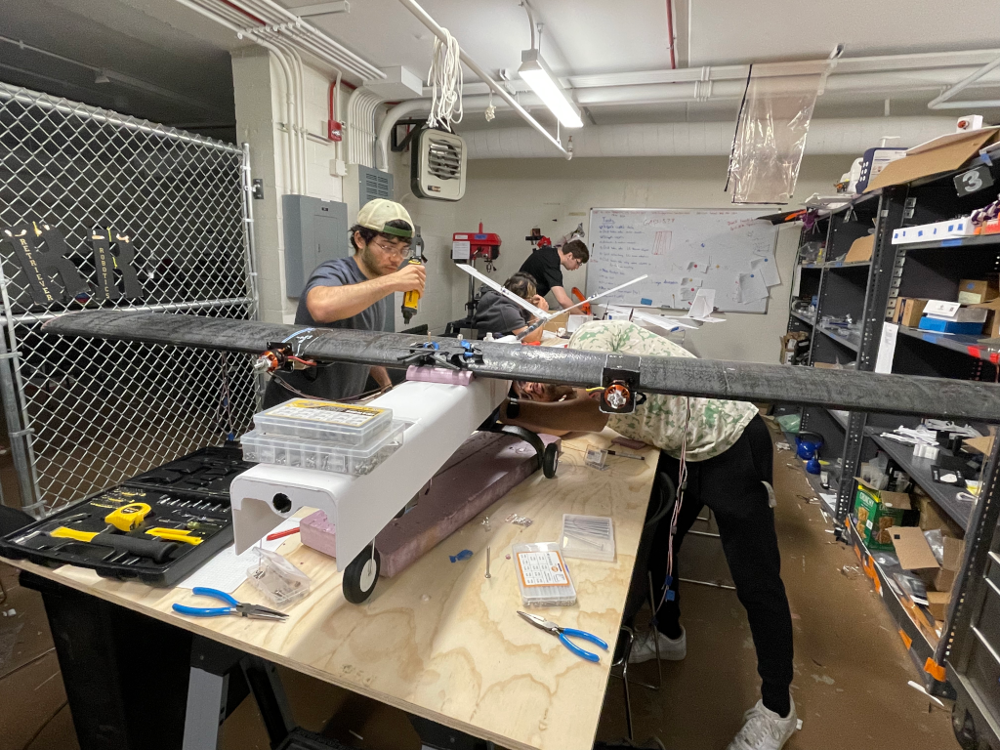

---
menus:
    main:
        parent: Development
Title: Creating the Fuselage
authors:
    - Nowrin
---

Figuring out the fuselage for the Gita XI 12 definitely involved a lot of trial and error. Since we were using foam, it was pretty forgiving. At first we made a smooth, curved fuselage thinking it would help with aerodynamics. But after our initial plane crashed, we took a step back and realized that a boxy fuselage could perform just as well and would be much easier to build, fix, and fit with components.

We started the process by building the internal ribs of the fuselage. These ribs helped define the structure of the plane and set the spacing for key components like the wings, electronics, and tail. Once the ribs were made, we designed the fuselage shape to wrap around them. This meant the outer foam shell had to match the width and height of the ribs, which gave us a custom-fit body that supported everything inside while keeping things lightweight.

The size of the fuselage was also based on the layout of the plane. We used a simple method to figure out how much fuselage we needed in front of the wing. By taking the distance from the wing to the tail and multiplying it by two-thirds, we found a length that worked well for balance and stability.

