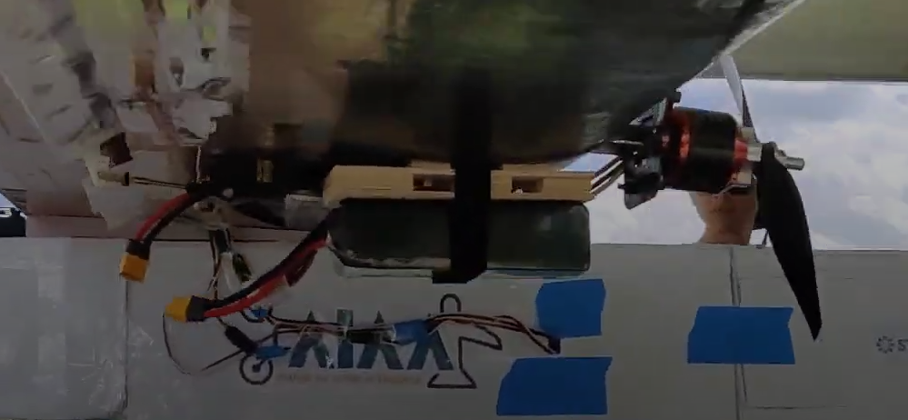

---
menus:
    main:
        parent: Development
Title: Manufacturing
showAuthor: true
authors:
    - Kai
---

<!-- Needs some pictures/videos -->

Due to the design decision of making the plane a dual motor powered aircraft, wing affixed motor mounts are required to ensure a proper connection to the aircraft, for both safety and the functionality of the plane. Since these motor mounts had to be very strong as well as light, carbon fiber was chosen. With the complex geometry of an airfoil, 3D printed molds were used to manufacture the Carbon Fiber mounts of both the top and bottom side of the wing to ensure a strong mount. Using 8 layer of plain weave carbon fiber was used by laminating them with a slow-cure resin, press molded between layers of plastic, breather fabric, and perforated release film to remove excess resin as well as protect the 3D printed molds for ease of disassembly and reuse. After 48 hours of curing, the plastic, and breather fabric is removed the carbon fiber motor mounts are ready for negative manufacturing. By cutting holes and smoothing the edges, we can make the motor mount safe to touch with the bare hand as well as ready to combine to be used on the wing of the aircraft.
 
With the carbon fiber mounts ready to be attached to the wing with two m6 bolts, a way to power the motors is necessary. Since a way to attach the battery is needed and the bolts are necessary to attach the motor mounts to the wing, it was seen to be the best idea to attach the battery mount to the motor mounts. Because the location of the batteries would be inline with the motor mount, a slipstream effect would help decrease the drag of the aircraft as well as make it easier to attach and detach the batteries for both safety and quick “refueling” of the plane between missions. By bolting a flat piece of flexible wood to the motor mount with a spacer between the motor mount and the battery mount, a very solid connection is made. Since the battery needed to be separated from the protruding bolt nuts, a second flat piece of wood was added on top of spacers to separate both slabs of wood. Now Velcro was attached to the bottom of the flat wood, and the battery is attached to the Velcro, using a strap between the motor mount and the battery mount that goes around the battery, compressing the wood and battery together, ensuring that the wood doesn't fail to shear stress, as the first design tested failed under load because of the weak tensile properties of plywood, securing the battery to the mount ensuring that it doesn't fall off the plane which would be a safety concern if not secured. 
