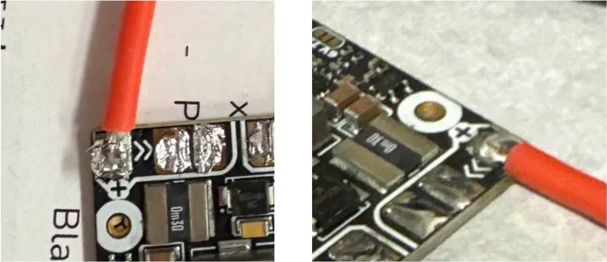
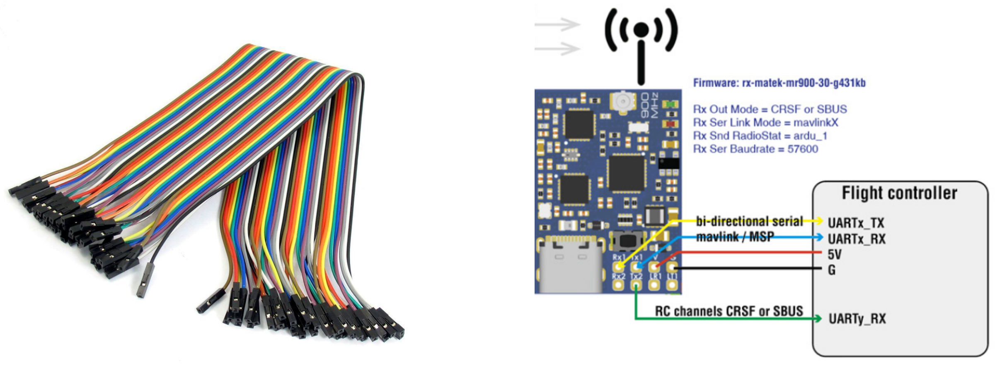

---
menus:
    main:
        parent: Documentation
Title: Electronics Connections
authors:
   - Will
---

Throughout our preparations for the competition this year, my responsibilities primarily involved hardware-related assembly. Specifically, I did many of the soldering required for the electrical components of the aircraft, including the flight-controller, GPS, LiDAR system, and RC receiver. This also involved consulting wiring diagrams to ensure that all pins and connections were in their correct places, as well as configuring software to allow for proper functionality, such as writing firmware to the flight controller. Further, having had prior soldering experience, I ensured that the aircraft’s solder joints appeared strong and re-did any improper connections as an important aspect of safety and reliability in the air.

## Flight-Controller Connections:

The flight-controller is the most major electronic component of the aircraft, as it connects to each of the aircraft’s servos, speed controller signal outputs, and peripherals. This necessitated custom-made wiring harnesses and connectors to meet the needs for our particular aircraft and its configuration. For example, the cable that was included for our LiDAR module needed to be lengthened to fit the aircraft and was incompatible with the flight controller we used, as its wires required pins at the ends in order to connect properly. To solve this, I spliced properly-lengthed wires to the ends of the connector to the module and attached pin headers to the other sides, ensuring that the connections were adequately strong and could connect to the correct locations on the flight-controller itself.

In addition to this, the flight controller originally had cold solder joints (solder joints made without enough heat, causing incomplete melting) for its power connectors. I made sure to redo these connections as an early step in our building process.

## Wiring the Radio Receiver:

Similarly to the LiDAR system, the RC receiver for our aircraft needed to be wired to the flight controller using pins. I used a similar approach to before by attaching pin headers to wires, except by soldering the wires directly to the receiver due to its design lacking pin connections.

